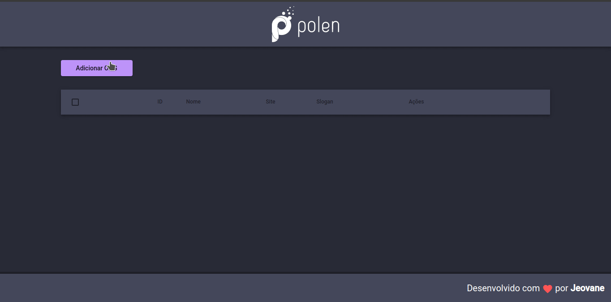
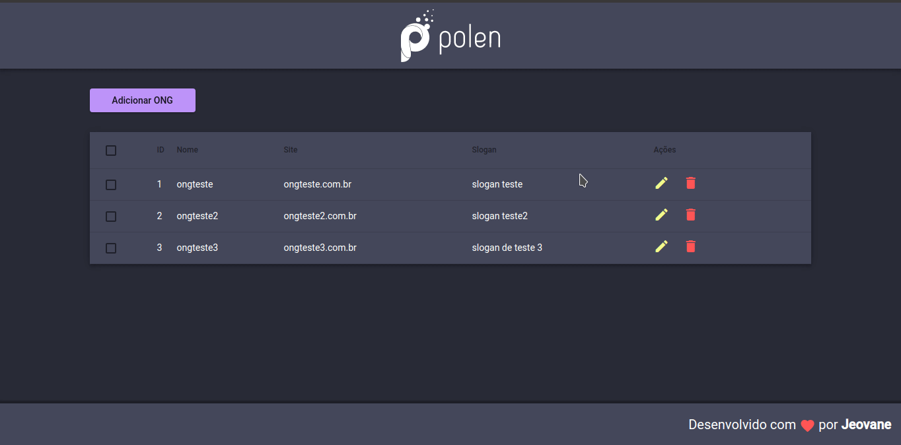
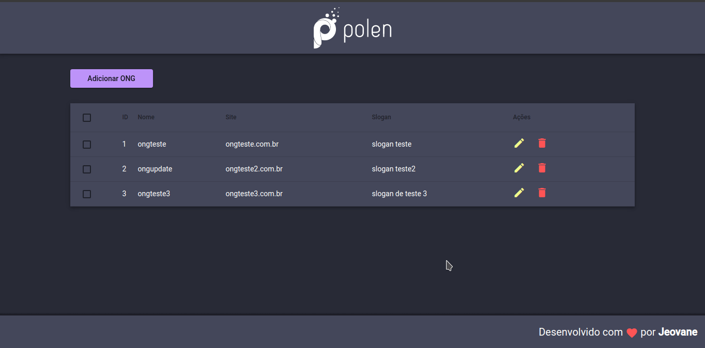
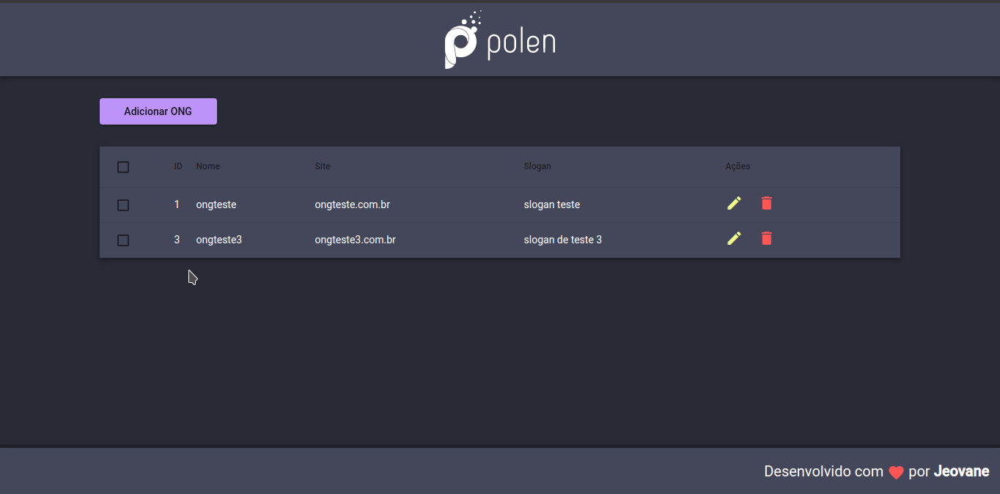

<h1 align="center">Polen Challenge</h1>
<h2 align="center">CRUD para ONGS usando Angular</h2>

<p align="center">
    <a href="https://nodejs.org/en/">
        
    </a>
</p>

<p align="center">
    <a href="https://angular.io/">
        
    </a>
</p>

## Sumário

- [:books: Sobre](#books-sobre)
- [:robot: Técnologias](#robot-técnologias)
- [:question: Como executar](#question-como-executar)
- [:computer: Visão Geral](#computer-visão-geral)

<a id="sobre"></a>
## :books: Sobre

Desafio proposto pela empresa Polen, o desafio consiste em criar um CRUD para o cadastro de ONGs.

<a id="tecnologias"></a>
## :robot: Técnologias

As principais técnologias utilizadas foram:

- [Node.js](https://nodejs.org/en/)
- [Angular](https://angular.io/)

## :question: Como executar

- #### **Requisitos**
    - Ter o [Agular CLI](https://cli.angular.io/)
    - Ter o [Node.js](https://nodejs.org/en/)
    - Ter um gerenciador de pacotes [NPM](https://www.npmjs.com/) ou [Yarn](https://yarnpkg.com/)

- #### Faça um clone
```sh
  $ https://github.com/jeovane16/polen-challenge.git
```

- #### Execute os comandos (de preferência na ordem mostrada) 

```sh

  # Entre na pasta do projeto e instale as dependencias
  $ cd polen-challenge
  $ yarn install

  # Caso utilize o npm
  $ npm install

  # Inicie a aplicação
  $ ng serve

```

<a id="visao-geral"></a>
## :computer: Visão Geral

- #### **Criar**
<h1 align="center">
    
</h1>

- #### **Atualizar**
<h1 align="center">
    
</h1>

- #### **Excluir**
<h1 align="center">
    
</h1>

- #### **Selecionar**
<h1 align="center">
    
</h1>
